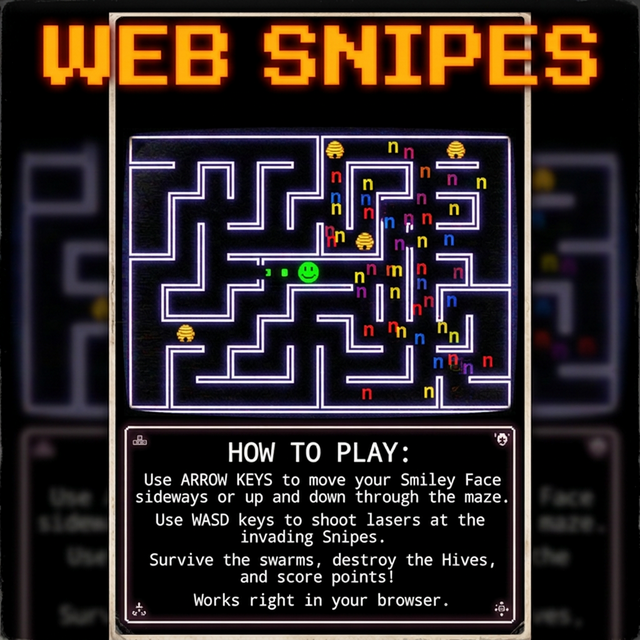

# WebSniper 🎯



Welcome to **WebSniper**, an action-packed multiplayer web adaptation of classic arcade shooter mechanics! Engage in fast-paced arena combat with your friends, direct from your web browser. 

This project consists of a full-stack multiplayer lobby and gameplay architecture designed to handle concurrent player sessions, real-time positional updates, and streamlined match management. 

## Features 🚀

- **Multiplayer Arena Gameplay:** Jump right into the action and play against others in real time.
- **Lobby System:** Wait for games to start in a dedicated matchmaking lobby.
- **Admin Dashboard:** Total control for match operations—start, manage, and monitor active game sessions.
- **Responsive Controls:** Fluid keyboard-based movement and shooting using modern HTML5 capabilities.
- **Docker Ready:** Effortless deployment using Docker Compose.

---

## Getting Started 🛠️

These instructions will get you a copy of the project up and running on your local machine for development and testing purposes.

### Prerequisites

You need [Docker](https://www.docker.com/) and [Docker Compose](https://docs.docker.com/compose/) installed on your machine.

### Installation & Deployment

1. **Clone the repository:**
   ```bash
   git clone https://github.com/yourusername/websniper.git
   cd websniper
   ```

2. **Start the containers:**
   The project ships with a pre-configured `docker-compose.yml` that handles both the client frontend and backend server.
   ```bash
   docker-compose up -d
   ```
   > **Note:** We use `restart: unless-stopped` for both services to ensure high availability.

4. **Updating the Game:**
   To pull the latest updates if the repository or image changes, simply pull the changes, rebuild or pull the fresh images, and restart:
   ```bash
   git pull origin main
   docker-compose pull
   docker-compose up -d --build
   ```

   - **Client:** Open your browser and navigate to `http://localhost:8080`.
   - **Backend API:** The server naturally binds to `http://localhost:3001`.

---

## Project Structure 📁

- `/client` - The frontend application (HTML/CSS/JS or framework variant) serving the game canvas and UI.
- `/server` - The backend game server responsible for state synchronization and admin tools.
- `/assets` - Visual resources, including the promotional graphics.
- `.github/workflows` - Out-of-the-box Continuous Integration strategies. We automatically generate a new release tag every time changes are pushed to `main` or `master`.

---

## Automated Releases 🔄

This repository uses GitHub Actions for an automated release workflow. On each commit to the main branch, generating a new tagged release (e.g., `v1.0.12`) is handled seamlessly. This drastically simplifies distributing the newest version of WebSniper to the open-source community.

---

## Contributing 🤝

Pull requests are welcome. For major changes, please open an issue first to discuss what you would like to change.

1. Fork the Project
2. Create your Feature Branch (`git checkout -b feature/AmazingFeature`)
3. Commit your Changes (`git commit -m 'Add some AmazingFeature'`)
4. Push to the Branch (`git push origin feature/AmazingFeature`)
5. Open a Pull Request

## License 📄

Distributed under the MIT License. See `LICENSE` for more information.
